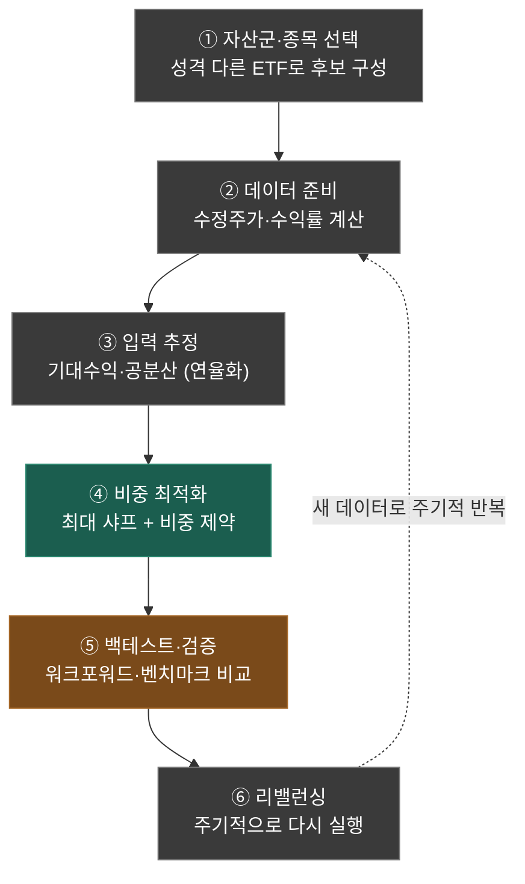

# 2강. 포트폴리오 전략의 전체 플로우

**대응 실습:** [01_basic.ipynb](../Play/01_basic.ipynb) · **이전 강의:** [1강. 무작위 탐색](01.md)

1강에선 코드 한 셀 안에서 "어떻게 계산하나"를 봤어요. 이번엔 한 발 물러서서
**이런 전략 하나를 처음부터 끝까지 만드는 전체 흐름**을 볼게요. 핵심 메시지는 하나예요:

> 네가 만든 무작위 탐색은 이 큰 파이프라인의 **딱 한 칸(④)** 일 뿐이에요.

---

## 한눈에 보는 전체 흐름



🟩 **최적화(핵심)** · 🟫 **검증** · ⬜ **준비·운영**

네 코드 `01_basic.ipynb`는 이 중 **②~④** 만 담겨 있어요. 앞의 ①(자산 선정)은 사람이
미리 정했고, 뒤의 ⑤~⑥(검증·리밸런싱)은 아직 비어 있어요. 그래서 "전체 알고리즘"으로
보면 가운데 토막인 셈이에요.

---

## ① 자산군·종목 선택 — 승패의 절반

"후보 종목을 뭘로 채우나"가 사실 전략의 절반을 결정해요. 최적화가 아무리 똑똑해도
후보가 별로면 좋은 답이 안 나와요 (*garbage in, garbage out*).

### 고를 때 보는 기준

| 기준 | 무슨 뜻 | 왜 중요한가 |
|---|---|---|
| **분산(서로 다르게 움직임)** | 같이 오르내리지 않는 것끼리 섞기 | **1순위.** 따로 노는 자산을 섞어야 위험이 줄어요 |
| 유동성 | 거래량이 충분한가 | 사고팔 때 가격이 안 튐 |
| 데이터 | 과거 가격이 충분히 쌓였나 | ③ 추정을 하려면 데이터가 필요 |
| 비용 | 수수료·ETF 보수 | 수익을 갉아먹음 |
| 접근성 | 내가 실제로 살 수 있나 | 제약 조건 |

제일 위의 **분산**이 핵심인데, 이게 ③의 **공분산(`cov_matrix`)** 과 직접 연결돼요.
"서로 다르게 움직이는 종목" = **공분산이 낮은 종목**이거든요. 선정 단계에서 이미 잘
분산되는 후보를 깔아놔야, 최적화가 위험을 진짜로 낮출 수 있어요.

### 큰 분류부터 좁히기

```
자산군(asset class)   주식 · 채권 · 원자재 · 부동산(REITs) · 현금
        ↓ 그 안에서
지역/섹터/스타일       미국·신흥국 / 기술·헬스케어 / 성장·가치
        ↓ 그 안에서
개별 종목·ETF         AAPL, JNJ, ...
```

이렇게 **레벨을 나눠** 골라야 "비슷한 것만 잔뜩" 담는 실수를 피해요.

> ⚠️ **네 코드의 함정:** `AAPL · MSFT · GOOGL`은 셋 다 미국 빅테크라 거의 한 몸처럼
> 움직여요(공분산 높음). 실질적으로 다른 자산은 헬스케어인 **JNJ 하나뿐**이에요.
> 4개 같지만 분산 관점에선 "테크 한 덩어리 + JNJ"라 사실상 2개에 가까워요.
> 채권 ETF(`TLT`)나 금(`GLD`)을 하나 섞으면 같은 코드로도 샤프지수가 확 달라져요.

---

## ②③ 데이터 준비 & 입력 추정 — '재료' 만들기

- **② 데이터 준비:** 가격을 받아 결측치를 정리하고, 일별 **수익률**로 바꿔요.
- **③ 입력 추정:** 최적화에 넣을 두 재료, **기대수익(평균)** 과 **공분산(위험)** 을 뽑아요.

> 💡 여기서 조심할 점: 기대수익은 **과거 평균일 뿐 미래 보장이 아니에요.** 추정이
> 조금만 틀려도 최적화 결과가 크게 흔들려요. "재료가 부실하면 요리도 부실하다"는 거죠.

---

## ④ 비중 최적화 — 네 코드의 심장

여기가 1강에서 한 **무작위 탐색**이에요. 목적함수(샤프지수)를 정하고, 제약(비중 합 = 1,
음수 금지) 안에서 제일 좋은 조합을 찾아요. 무작위 탐색은 가장 단순한 방법이고, 나중엔
경사하강법·볼록 최적화 같은 **더 똑똑한 탐색**으로 바꿔 끼울 수 있어요.

---

## ⑤ 백테스트·검증 — 지금 코드의 가장 큰 빈칸

2만 번 돌려 고른 "최고 조합"은 어디까지나 **과거 데이터에서** 최고였을 뿐이에요.
미래에도 최고라는 보장은 없죠. 이거, 바로 전에 머신러닝에서 본 **과적합과 똑같은 문제**예요.

그래서 실무에선 기간을 나눠서 **과거로 고르고 → 그 뒤 기간으로 검증(워크포워드)** 하고,
"그냥 시장 전체(벤치마크)보다 나았나?"를 따져봐요. 운이었는지 실력이었는지 가르는 단계예요.

---

## ⑥ 리밸런싱 — 한 번 하고 끝이 아니다

시간이 지나면 가격이 변해서 비중이 틀어져요. 그래서 **주기적으로(예: 분기마다) ②로
돌아가** 새 데이터로 다시 계산해 비중을 맞춰요. 위 그림의 점선 화살표가 이 반복 루프예요.
이때 매번 사고파는 **거래 비용**도 고려해야 하고요.

---

## 정리

**잘 분산된 후보를 깔고(①) → 재료를 만들고(②③) → 최적 조합을 찾고(④) → 과적합을 거르고(⑤)
→ 주기적으로 갱신(⑥)** 한다, 이게 한 사이클이에요. 네 코드는 가운데(②~④)를 잘 구현했고,
앞뒤(①·⑤⑥)를 채우면 진짜 '전략'이 돼요.

## 🎯 직접 해보기

1. 후보에 `TLT`(채권), `GLD`(금)를 추가하면 추천 비중과 샤프지수가 어떻게 변하나요?
2. 데이터 기간을 '2022년 이전'으로 학습하고 '2023년 이후'로 검증하면, 그 비중이 미래에도 좋았나요?
3. 리밸런싱을 1년에 1번 vs 매달 한다고 하면, 거래 비용은 어느 쪽이 더 들까요?
